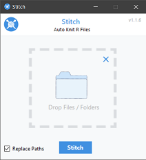
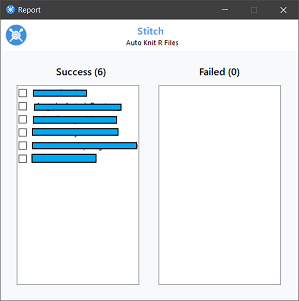

# Stitch
A C# .NET application to automatically knit RMarkdown files and show which passed & failed.

I built this app to help my statistics lecturer and assistant teachers to quickly assess submitted 
assignments. Initially it was a task that took hours because:
1. They needed to replace all source file paths in the submitted rmds(R-Markdown files) with their own source paths. 
2. They needed to quickly tell the rmds which knitted from those which didn't to quickly asssess things. 

## Usage
1. Drag and drop folder or files to the dragdrop area. Stitch will automatically pick out the RMarkdown files
2. Stitch can help you replace source paths in all dropped files in just one go.
3. Knitting is automatic, showing progress as it knits 
4. Final report is shown displaying two lists: the ones that knitted successfully and the ones htat didn't 

## Screenshots

